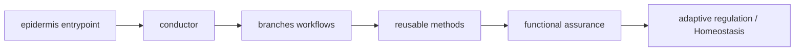

# Genome map — Chohogi topology and expression

_Generated by `python3 tooling/genome_map.py build`; do not edit manually._

Source digest: `029503acaa656285a622fccd680f4472812369069ca5749c5fa7552beb57e773`

## Current graph

| Node kind | Count |
| --- | ---: |
| asset | 87 |
| component | 6 |
| document | 3 |
| endpoint | 5 |
| skill | 5 |
| verifier | 12 |

## Active reusable methods

`accessibility`, `core-web-vitals`, `performance`, `react-async-state-safety`, `security-and-hardening`

## Machine representation

See `genome-map.graph.json` for nodes, edges, evidence paths, and the source digest.
