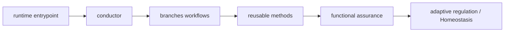

# Genome map — Chohogi topology and expression

_Generated by `python3 tooling/genome_map.py build`; do not edit manually._

Source digest: `9867ad1526e54386aa48ced1264daca95ba05b55e7c525ec4a52eaa22aff21a5`

## Current graph

| Node kind | Count |
| --- | ---: |
| asset | 223 |
| component | 11 |
| document | 3 |
| endpoint | 8 |
| skill | 11 |
| verifier | 16 |

## Active reusable methods

`accessibility`, `agent-security-audit`, `core-web-vitals`, `dependency-scanning`, `hallmark`, `mcp-server-review`, `performance`, `prompt-injection`, `secure-code-review`, `security-and-hardening`, `threat-modeling`

## Machine representation

See `genome-map.graph.json` for nodes, edges, evidence paths, and the source digest.
