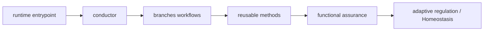

# Genome map — Chohogi topology and expression

_Generated by `python3 tooling/genome_map.py build`; do not edit manually._

Source digest: `9a1dfa5ecd5acf12e4c0ffb158d81a5b9c9cbb1b72ead1800399a375204b0b37`

## Current graph

| Node kind | Count |
| --- | ---: |
| asset | 113 |
| component | 6 |
| document | 3 |
| endpoint | 5 |
| skill | 13 |
| verifier | 13 |

## Active reusable methods

`accessibility`, `agent-security-audit`, `core-web-vitals`, `dependency-scanning`, `frontend-surface`, `hallmark`, `mcp-server-review`, `performance`, `prompt-injection`, `react-async-state-safety`, `secure-code-review`, `security-and-hardening`, `threat-modeling`

## Machine representation

See `genome-map.graph.json` for nodes, edges, evidence paths, and the source digest.
