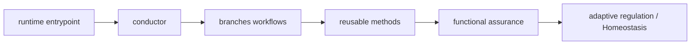

# Genome map — Chohogi topology and expression

_Generated by `python3 tooling/genome_map.py build`; do not edit manually._

Source digest: `5fa938bf05f4b9f070f73554346f3c3a5edec089abfd0610ca64037f5f6ef8be`

## Current graph

| Node kind | Count |
| --- | ---: |
| asset | 216 |
| component | 8 |
| document | 3 |
| endpoint | 5 |
| skill | 11 |
| verifier | 13 |

## Active reusable methods

`accessibility`, `agent-security-audit`, `core-web-vitals`, `dependency-scanning`, `hallmark`, `mcp-server-review`, `performance`, `prompt-injection`, `secure-code-review`, `security-and-hardening`, `threat-modeling`

## Machine representation

See `genome-map.graph.json` for nodes, edges, evidence paths, and the source digest.
