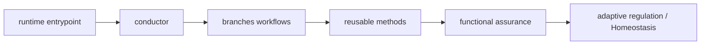

# Genome map — Chohogi topology and expression

_Generated by `python3 tooling/genome_map.py build`; do not edit manually._

Source digest: `7a0684a50b06ba631f98b6d3a97204ba29f120bf9814ec93f030e0715be386ab`

```mermaid
flowchart LR
  E[runtime entrypoint] --> C[conductor]
  C --> W[branches workflows]
  W --> M[reusable methods]
  M --> F[functional assurance]
  F --> H[adaptive regulation / Homeostasis]
```

## Current graph

| Node kind | Count |
| --- | ---: |
| asset | 241 |
| component | 11 |
| document | 14 |
| skill | 12 |
| slot | 5 |
| verifier | 18 |

## Active reusable methods

`accessibility`, `agent-security-audit`, `core-web-vitals`, `dependency-scanning`, `hallmark`, `mcp-server-review`, `performance`, `prompt-injection`, `secure-code-review`, `security-and-hardening`, `session-forensics`, `threat-modeling`

## Machine representation

See `genome-map.graph.json` for nodes, edges, evidence paths, and the source digest.
