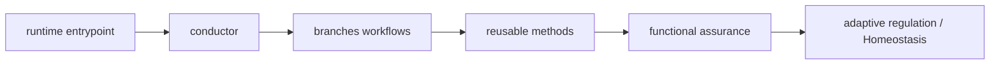

# Genome map — Chohogi topology and expression

_Generated by `python3 tooling/genome_map.py build`; do not edit manually._

Source digest: `6137e47e05ffe3e4364d71f5cab1b75f6c60065bb6779f2a575ba5d2ca6a24b0`

```mermaid
flowchart LR
  E[runtime entrypoint] --> C[conductor]
  C --> W[branches workflows]
  W --> M[reusable methods]
  M --> F[functional assurance]
  F --> H[adaptive regulation / Homeostasis]
```

## Current graph

| Node kind | Count |
| --- | ---: |
| asset | 245 |
| component | 19 |
| document | 14 |
| endpoint | 16 |
| skill | 12 |
| verifier | 20 |

## Active reusable methods

`accessibility`, `agent-security-audit`, `core-web-vitals`, `dependency-scanning`, `hallmark`, `mcp-server-review`, `performance`, `prompt-injection`, `secure-code-review`, `security-and-hardening`, `session-forensics`, `threat-modeling`

## Machine representation

See `genome-map.graph.json` for nodes, edges, evidence paths, and the source digest.
